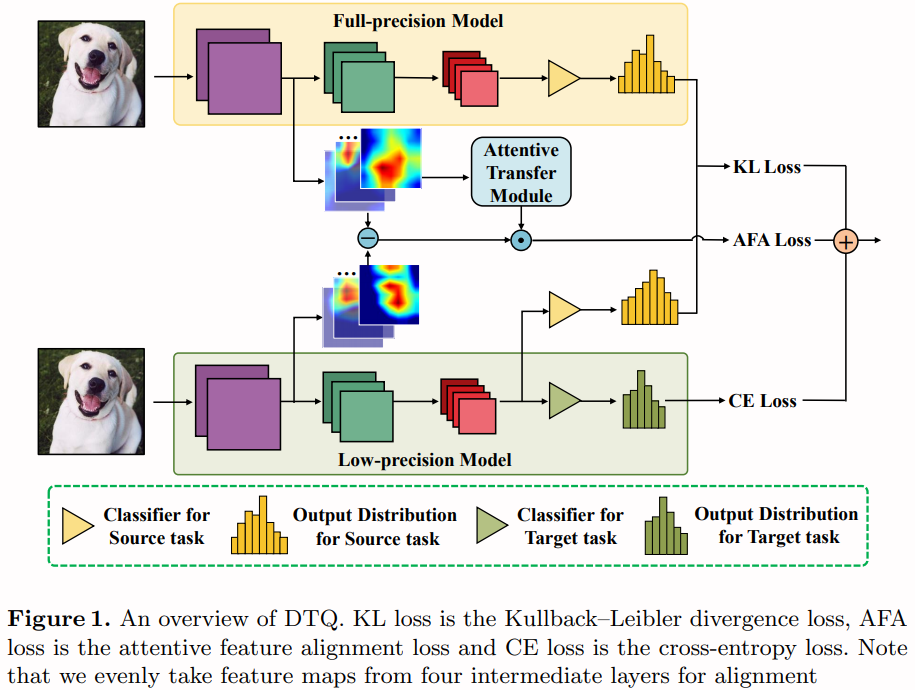

# Deep Transferring Quantization

We provide PyTorch implementation for ["Deep Transferring Quantization"](https://tanmingkui.github.io/files/publications/Deep_Transferring.pdf) (ECCV2020).

## Paper
* Deep Transferring Quantization
* Zheng Xie *, Zhiquan Wen *, Jing Liu *, Zhiqiang Liu, Xixian Wu, and Mingkui Tan *
* European Conference on Computer Vision (ECCV), 2020

 

## Dependencies

* Python 3.6
* PyTorch 1.1.0
* dependencies in requirements.txt

## Getting Started

### Installation

1. Clone this repository:

        git clone https://github.com/xiezheng-cs/DTQ.git
        cd DTQ

2. Install PyTorch and other dependencies:

        pip install -r requirements.txt

### Training

To quantize the pre-trained MobileNetV2 on Caltech 256-30 to 4-bit:

    python main.py hocon_config/mobilenetv2_caltech-256-30.hocon

To quantize the pre-trained ResNet-50 on Caltech 256-30 to 4-bit:

    python main.py hocon_config/resnet50_caltech-256-30.hocon

 

## Experimental Results

  |  Target Data Set | Model | W / A | DELTA-Q Top1 Acc(%) | DTQ(Ours) Top1 Acc(%) |
   | :-: | :-: | :-: | :-: | :-: |
  | Caltech 256-30 | MobileNetV2 | 4 / 4 | 74.0±0.7 | **75.9±1.2** |
  | Caltech 256-30 |  ResNet-50  | 4 / 4 | 82.8±0.5 | **83.5±0.6** |

 

## Citation
If this work is useful for your research, please cite our paper:

    @InProceedings{xie2020deep,
    title = {Deep Transferring Quantization},
    author = {Zheng, Xie and Zhiquan, Wen and Jing, Liu and Zhiqiang, Liu and Xixian, Wu and Mingkui, Tan},
    booktitle = {European Conference on Computer Vision},
    year = {2020}
    }

 

## Acknowledgments
This work was partially supported by the Key-Area Research and Development Program of Guangdong Province 2019B010155002, National Natural Science Foundation of China (NSFC) 61836003 (key project), Program for Guangdong Introducing Innovative and Entrepreneurial Teams 2017ZT07X183, Fundamental Research Funds for the Central Universities D2191240.
